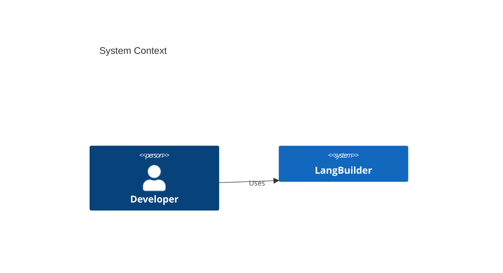

# LangBuilder Architecture Documentation

## Overview

This directory contains comprehensive architecture documentation for LangBuilder, an AI workflow builder using LangChain. The documentation follows the C4 model for software architecture and covers system design, deployment, data flows, and architectural patterns.

## Quick Links

| Document | Description |
|----------|-------------|
| [System Architecture](./system-architecture.md) | High-level overview and key decisions |
| [C4 Context](./c4-context.md) | System context diagram (Level 1) |
| [C4 Container](./c4-container.md) | Container diagram (Level 2) |
| [C4 Backend Components](./c4-component-backend.md) | Backend component diagram (Level 3) |
| [C4 Frontend Components](./c4-component-frontend.md) | Frontend component diagram (Level 3) |
| [Deployment Topology](./deployment-topology.md) | Deployment architecture and Docker setup |
| [Data Architecture](./data-architecture.md) | Database schema and data flows |
| [Patterns & Principles](./patterns-and-principles.md) | Design patterns and coding conventions |

## System Summary

**LangBuilder** is a visual AI workflow builder that enables developers to create, deploy, and manage LangChain-based workflows through an intuitive drag-and-drop interface.

### Key Facts

| Attribute | Value |
|-----------|-------|
| **Version** | 1.6.5 |
| **License** | MIT |
| **Repository** | https://github.com/CloudGeometry/langbuilder |
| **Python** | 3.10-3.14 |
| **Backend** | FastAPI |
| **Frontend** | React 18 + TypeScript |
| **AI Framework** | LangChain 0.3.x |

### Architecture Highlights

```
                    +------------------+
                    |     Users        |
                    +--------+---------+
                             |
                    +--------v---------+
                    |    Traefik       |
                    |  (Load Balancer) |
                    +--------+---------+
                             |
           +-----------------+-----------------+
           |                                   |
  +--------v---------+              +----------v--------+
  |   Frontend       |              |    Backend API    |
  | (React + XY Flow)|<------------>|  (FastAPI)        |
  +------------------+              +---+-----+---------+
                                        |     |
                    +-------------------+     +------------------+
                    |                                            |
          +---------v----------+                    +------------v-----------+
          |    PostgreSQL      |                    |    External Systems    |
          |    (Database)      |                    | (LLMs, Vector Stores)  |
          +--------------------+                    +------------------------+
```

## Documentation Structure

### C4 Model Diagrams

The architecture uses the [C4 model](https://c4model.com/) for visualizing software architecture at different levels of abstraction:

1. **Level 1 - Context**: Shows how LangBuilder fits into the world
2. **Level 2 - Container**: Shows the high-level technology choices
3. **Level 3 - Component**: Shows how containers are made up of components

### Mermaid Diagrams

All diagrams are written in Mermaid syntax for easy rendering in GitHub, GitLab, and other Markdown viewers. Example:



## Technology Stack

### Backend

| Layer | Technology |
|-------|------------|
| API Framework | FastAPI |
| AI Framework | LangChain 0.3.x |
| ORM | SQLModel |
| Database | PostgreSQL / SQLite |
| Migrations | Alembic |
| Task Queue | Celery + RabbitMQ |
| Cache | Redis |

### Frontend

| Layer | Technology |
|-------|------------|
| Framework | React 18 |
| Language | TypeScript 5.4 |
| Build Tool | Vite 5.4 |
| Flow Canvas | @xyflow/react |
| State | Zustand |
| Styling | TailwindCSS + Radix UI |

### Infrastructure

| Component | Technology |
|-----------|------------|
| Load Balancer | Traefik |
| Containers | Docker |
| Monitoring | Prometheus + Grafana |

## Component Categories

LangBuilder provides 12 categories of pre-built components:

| Category | Count | Examples |
|----------|-------|----------|
| Models (LLMs) | 24 | OpenAI, Anthropic, Google |
| Vector Stores | 19 | Pinecone, Chroma, Qdrant |
| Integrations | 30+ | HubSpot, Jira, Apollo |
| Agents | - | ReAct, Tool-using |
| Tools | - | Search, Calculators |
| Data | - | File loaders, APIs |

## Key Architectural Decisions

1. **Monorepo Structure**: UV workspace with 3 packages for maintainability
2. **Graph Execution Engine**: Custom engine for parallel vertex execution
3. **Component System**: Declarative components with automatic UI generation
4. **Real-time Updates**: SSE for build progress streaming
5. **Provider Agnostic**: LangChain abstractions for LLM provider switching

## Getting Started

### Development Setup

```bash
# Clone repository
git clone https://github.com/CloudGeometry/langbuilder.git
cd langbuilder

# Install dependencies
uv sync

# Run backend
uv run langbuilder run

# Run frontend (separate terminal)
cd langbuilder/src/frontend
npm install
npm run dev
```

### Docker Deployment

```bash
cd langbuilder/deploy
docker-compose up -d
```

## Related Documentation

- [API Documentation](../api/) - REST API reference
- [Onboarding Guide](../onboarding/) - Developer onboarding
- [Testing Guide](../testing/) - Test strategy and coverage

---

*Generated by CloudGeometry AIx SDLC - Architecture Documentation*
*Last updated: 2026-01-21*
