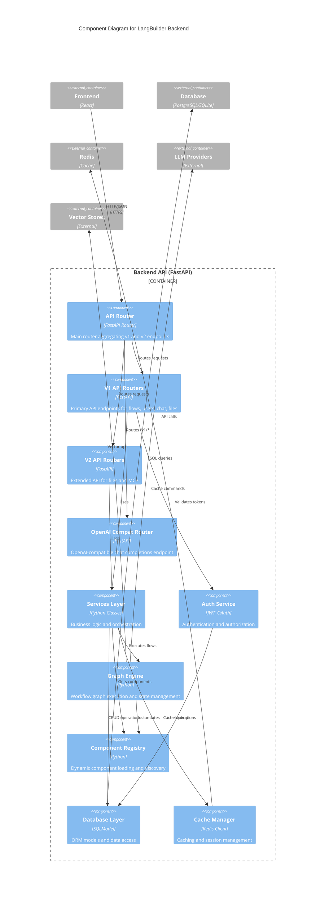

# C4 Component Diagram - Backend

## Overview

This document presents the Component (Level 3) diagram for the LangBuilder Backend API, showing the internal structure and responsibilities of the FastAPI application.

## Backend Component Diagram



## Component Details

### API Layer

#### Main API Router
- **Path**: `langbuilder/src/backend/base/langbuilder/api/router.py`
- **Purpose**: Aggregates all API routers and mounts them on the FastAPI app
- **Key Routes**:
  - `/api/v1/*` - Primary API
  - `/api/v2/*` - Extended API
  - `/v1/*` - OpenAI compatibility
  - `/health` - Health check

#### V1 API Routers (18 routers)

| Router | Path | File | Operations |
|--------|------|------|------------|
| **flows** | `/api/v1/flows` | `v1/flows.py` | CRUD, upload, download, batch |
| **chat** | `/api/v1/build` | `v1/chat.py` | Build flow, events stream, cancel |
| **users** | `/api/v1/users` | `v1/users.py` | User CRUD operations |
| **api_key** | `/api/v1/api_key` | `v1/api_key.py` | API key management |
| **login** | `/api/v1/login` | `v1/login.py` | Auth: login, logout, refresh |
| **files** | `/api/v1/files` | `v1/files.py` | File upload/download |
| **folders** | `/api/v1/folders` | `v1/folders.py` | Project organization |
| **projects** | `/api/v1/projects` | `v1/projects.py` | Project management |
| **variables** | `/api/v1/variables` | `v1/variable.py` | Global variables |
| **monitor** | `/api/v1/monitor` | `v1/monitor.py` | Execution monitoring |
| **endpoints** | `/api/v1/run` | `v1/endpoints.py` | Run deployed flows |
| **validate** | `/api/v1/validate` | `v1/validate.py` | Flow validation |
| **store** | `/api/v1/store` | `v1/store.py` | Component store |
| **publish** | `/api/v1/publish` | `v1/publish.py` | OpenWebUI publish |
| **mcp** | `/api/v1/mcp` | `v1/mcp.py` | MCP protocol (SSE/POST) |
| **mcp_projects** | `/api/v1/mcp/projects` | `v1/mcp_projects.py` | MCP server management |
| **starter_projects** | `/api/v1/starter-projects` | `v1/starter_projects.py` | Template flows |
| **voice_mode** | `/api/v1/voice` | `v1/voice_mode.py` | Voice interface |

#### V2 API Routers (2 routers)

| Router | Path | File | Operations |
|--------|------|------|------------|
| **files** | `/api/v2/files` | `v2/files.py` | Enhanced file operations |
| **mcp** | `/api/v2/mcp` | `v2/mcp.py` | MCP servers management |

#### OpenAI Compatibility Router
- **Path**: `langbuilder/src/backend/base/langbuilder/api/openai_compat_router.py`
- **Endpoints**:
  - `GET /v1/models` - List available flows as models
  - `POST /v1/chat/completions` - Chat completions compatible endpoint

### Services Layer

**Path**: `langbuilder/src/backend/base/langbuilder/services/`

| Service | File | Responsibility |
|---------|------|---------------|
| **Base Service** | `base.py` | Abstract base for all services |
| **Service Factory** | `factory.py` | Dependency injection container |
| **Service Manager** | `manager.py` | Service lifecycle management |
| **Dependencies** | `deps.py` | FastAPI dependency functions |
| **OpenWebUI Client** | `openwebui_client.py` | Integration with Open WebUI |
| **Schema** | `schema.py` | Service DTOs and schemas |
| **Utils** | `utils.py` | Shared utilities |

### Graph Execution Engine

**Path**: `langbuilder/src/backend/base/langbuilder/graph/`

```
graph/
├── __init__.py          # Public API exports
├── schema.py            # Graph-level schemas
├── utils.py             # Graph utilities
├── edge/                # Edge handling
│   ├── base.py          # Edge class
│   ├── schema.py        # Edge schemas
│   └── utils.py         # Edge utilities
├── graph/               # Graph execution
│   ├── base.py          # Graph class - main execution
│   ├── runnable_vertices_manager.py  # Parallel execution
│   ├── state_model.py   # Graph state management
│   ├── constants.py     # Graph constants
│   └── utils.py         # Graph utilities
├── vertex/              # Node (vertex) handling
│   ├── base.py          # Vertex base class
│   ├── vertex_types.py  # Type definitions
│   ├── param_handler.py # Parameter processing
│   ├── constants.py     # Vertex constants
│   └── exceptions.py    # Vertex exceptions
└── state/               # Execution state
    └── model.py         # State model
```

**Key Classes**:
- `Graph`: Main graph class that manages workflow execution
- `Vertex`: Represents a node in the workflow graph
- `Edge`: Represents connections between vertices
- `RunnableVerticesManager`: Handles parallel vertex execution
- `StateModel`: Manages execution state across the graph

### Component Registry

**Path**: `langbuilder/src/backend/base/langbuilder/components/`

**Categories (12)**:
| Category | Components | Examples |
|----------|------------|----------|
| **agents** | Agent components | Tool-using agents, ReAct |
| **models** | LLM providers | OpenAI, Anthropic, Google |
| **embeddings** | Embedding models | OpenAI, HuggingFace |
| **vectorstores** | Vector databases | Pinecone, Chroma, Qdrant |
| **tools** | Tool integrations | Search, calculators |
| **data** | Data loaders | File, URL, database |
| **processing** | Text processing | Splitters, parsers |
| **input_output** | I/O components | Chat, webhook |
| **logic** | Control flow | Conditional, router |
| **helpers** | Utility components | Memory, callbacks |
| **custom_component** | User-defined | Custom Python code |
| **prototypes** | Experimental | Beta features |

**LLM Providers (24)**:
`openai`, `anthropic`, `google`, `azure`, `huggingface`, `ollama`, `groq`, `cohere`, `mistral`, `deepseek`, `nvidia`, `amazon`, `vertexai`, `xai`, `perplexity`, `openrouter`, `lmstudio`, `sambanova`, `maritalk`, `novita`, `olivya`, `notdiamond`, `cloudflare`, `ibm`

**Vector Stores (19)**:
`AstraDB`, `Cassandra`, `Chroma`, `Clickhouse`, `Couchbase`, `Elasticsearch`, `FAISS`, `HCD`, `Milvus`, `MongoDB`, `OpenSearch`, `PGVector`, `Pinecone`, `Qdrant`, `Redis`, `Supabase`, `Upstash`, `Vectara`, `Weaviate`

### Database Layer

**Path**: `langbuilder/src/backend/base/langbuilder/services/database/`

**ORM**: SQLModel (SQLAlchemy + Pydantic hybrid)

**Models (10)**:
| Model | Table | Description |
|-------|-------|-------------|
| `User` | user | User accounts |
| `Flow` | flow | Workflow definitions |
| `Folder` | folder | Project folders |
| `ApiKey` | apikey | API key storage |
| `Variable` | variable | Encrypted credentials |
| `MessageTable` | message | Chat messages |
| `File` | file | File metadata |
| `TransactionTable` | transaction | Execution logs |
| `VertexBuildTable` | vertex_build | Build results |
| `PublishRecord` | publish_record | Publication tracking |

### Authentication Service

**Features**:
- JWT token-based authentication
- Refresh token rotation
- API key authentication for endpoints
- Auto-login for development
- Session management via Redis

## Request Flow

```
1. Request arrives at FastAPI
2. Middleware: CORS, Auth token validation
3. Router dispatches to appropriate handler
4. Handler calls Service layer
5. Service orchestrates:
   - Database operations (SQLModel)
   - Graph execution (for /build, /run)
   - External API calls (LLM, vectors)
   - Cache operations (Redis)
6. Response serialized and returned
```

## Dependency Injection

FastAPI dependency injection is used throughout:

```python
# Example from deps.py
async def get_current_user(
    token: str = Depends(oauth2_scheme),
    session: AsyncSession = Depends(get_session)
) -> User:
    ...

# Usage in router
@router.get("/flows")
async def list_flows(
    current_user: User = Depends(get_current_user),
    session: AsyncSession = Depends(get_session)
):
    ...
```

---

*Generated by CloudGeometry AIx SDLC - Architecture Documentation*
