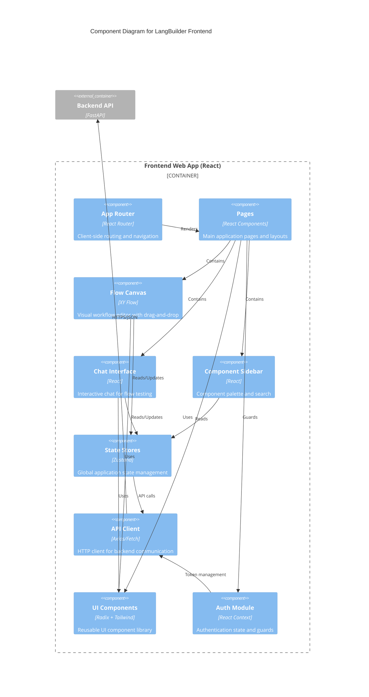

# C4 Component Diagram - Frontend

## Overview

This document presents the Component (Level 3) diagram for the LangBuilder Frontend, showing the internal structure of the React application.

## Frontend Component Diagram



## Component Details

### Application Router

**Path**: `langbuilder/src/frontend/src/App.tsx`

**Route Structure**:
```
/                     -> MainPage (Dashboard)
/flow/:id             -> FlowPage (Workflow Editor)
/login                -> LoginPage
/admin                -> AdminPage
/settings/*           -> Settings Pages
/files                -> FilesPage
/knowledge            -> KnowledgePage
/store                -> StorePage
```

### Pages

**Path**: `langbuilder/src/frontend/src/pages/`

| Page | File | Purpose |
|------|------|---------|
| **MainPage** | `MainPage/index.tsx` | Dashboard with flows list |
| **FlowPage** | `FlowPage/index.tsx` | Workflow editor canvas |
| **LoginPage** | `LoginPage/index.tsx` | User authentication |
| **AdminPage** | `AdminPage/index.tsx` | Admin dashboard |
| **FilesPage** | `MainPage/pages/filesPage/` | File management |
| **KnowledgePage** | `MainPage/pages/knowledgePage/` | Knowledge base management |
| **StorePage** | `MainPage/pages/storePage/` | Component store |
| **SettingsPage** | `SettingsPage/` | User settings |

### Flow Canvas (XY Flow)

**Path**: `langbuilder/src/frontend/src/pages/FlowPage/components/PageComponent/`

**Key Components**:

| Component | File | Responsibility |
|-----------|------|---------------|
| **PageComponent** | `index.tsx` | Main canvas container |
| **ConnectionLine** | `ConnectionLineComponent/` | Edge drawing |
| **SelectionMenu** | `SelectionMenuComponent/` | Multi-select actions |
| **UpdateAllComponents** | `UpdateAllComponents/` | Bulk updates |
| **FlowBuilding** | `flowBuildingComponent/` | Build progress |

**Custom Nodes**:
- **Path**: `langbuilder/src/frontend/src/CustomNodes/`
- **GenericNode**: Standard component node with inputs/outputs
- **NoteNode**: Sticky note annotation node

**Node Sub-components**:
| Component | Purpose |
|-----------|---------|
| `NodeName` | Display node title |
| `NodeIcon` | Component icon |
| `NodeStatus` | Build/error status |
| `NodeInputField` | Input parameter fields |
| `NodeOutputfield` | Output handles |
| `HandleTooltip` | Connection tooltips |
| `OutputModal` | Output inspection |

### Chat Interface

**Path**: `langbuilder/src/frontend/src/components/core/chatComponents/`

| Component | Purpose |
|-----------|---------|
| `ContentDisplay` | Message rendering |
| `ContentBlockDisplay` | Rich content blocks |
| `ChatInput` | User input field |
| `ChatMessage` | Individual message |
| `PlaygroundChat` | Chat playground |

### Component Sidebar

**Path**: `langbuilder/src/frontend/src/pages/FlowPage/components/flowSidebarComponent/`

| Component | File | Purpose |
|-----------|------|---------|
| **FlowSidebar** | `index.tsx` | Main sidebar container |
| **CategoryGroup** | `categoryGroup.tsx` | Category sections |
| **CategoryDisclose** | `categoryDisclouse.tsx` | Collapsible categories |
| **SearchInput** | `searchInput.tsx` | Component search |
| **SidebarDraggable** | `sidebarDraggableComponent.tsx` | Draggable items |
| **SidebarItemsList** | `sidebarItemsList.tsx` | Component list |
| **McpSidebarGroup** | `McpSidebarGroup.tsx` | MCP tools section |
| **BundleItems** | `bundleItems.tsx` | Bundled components |

### State Management (Zustand)

**Path**: `langbuilder/src/frontend/src/stores/`

| Store | File | State Managed |
|-------|------|---------------|
| **flowStore** | `flowStore.ts` | Current flow state, nodes, edges |
| **flowsManagerStore** | `flowsManagerStore.ts` | All flows list, CRUD |
| **authStore** | `authStore.ts` | User authentication state |
| **alertStore** | `alertStore.ts` | Notifications and alerts |
| **typesStore** | `typesStore.ts` | Component type definitions |
| **messagesStore** | `messagesStore.ts` | Chat messages |
| **darkStore** | `darkStore.ts` | Theme preferences |
| **globalVariablesStore** | `globalVariables.ts` | Global variables |
| **shortcutsStore** | `shortcuts.ts` | Keyboard shortcuts |
| **utilityStore** | `utilityStore.ts` | UI utilities |
| **storeStore** | `storeStore.ts` | Component store state |
| **locationStore** | `locationStore.ts` | Navigation state |
| **voiceStore** | `voiceStore.ts` | Voice mode state |
| **tweaksStore** | `tweaksStore.ts` | API tweaks config |
| **durationStore** | `durationStore.ts` | Execution timing |

**Store Pattern Example**:
```typescript
// flowStore.ts
import { create } from 'zustand';

interface FlowState {
  nodes: Node[];
  edges: Edge[];
  addNode: (node: Node) => void;
  updateNode: (id: string, data: Partial<Node>) => void;
  // ...
}

export const useFlowStore = create<FlowState>((set, get) => ({
  nodes: [],
  edges: [],
  addNode: (node) => set((state) => ({ nodes: [...state.nodes, node] })),
  // ...
}));
```

### API Client

**Path**: `langbuilder/src/frontend/src/controllers/API/`

**Structure**:
```
controllers/API/
├── api.tsx           # Base Axios instance
├── helpers/          # API utilities
└── queries/          # React Query hooks
    ├── flows/        # Flow CRUD
    ├── users/        # User operations
    ├── files/        # File operations
    ├── messages/     # Chat messages
    └── ...
```

**Features**:
- Axios-based HTTP client
- React Query for data fetching/caching
- Automatic token refresh
- Error handling interceptors

### UI Components

**Path**: `langbuilder/src/frontend/src/components/`

**Component Categories**:

| Category | Path | Examples |
|----------|------|----------|
| **common** | `common/` | Loading, Icons, Tooltips |
| **core** | `core/` | Header, Canvas Controls |
| **ui** | `ui/` | Buttons, Inputs, Dialogs |
| **authorization** | `authorization/` | Auth guards |

**UI Framework**:
- **Radix UI**: Headless components (Dialog, Dropdown, etc.)
- **TailwindCSS**: Utility-first styling
- **Lucide**: Icon library

### Authentication Module

**Path**: `langbuilder/src/frontend/src/components/authorization/`

| Guard | Purpose |
|-------|---------|
| `AuthGuard` | Requires authentication |
| `AuthLoginGuard` | Redirects if authenticated |
| `AuthAdminGuard` | Requires admin role |
| `AuthSettingsGuard` | Settings access control |
| `StoreGuard` | Store access control |

## Data Flow

```
User Interaction
       |
       v
+-------------+    +------------+    +-----------+
| UI Component| -> | Zustand    | -> | API Client|
| (React)     |    | Store      |    | (Axios)   |
+-------------+    +------------+    +-----------+
       ^                                   |
       |                                   v
       +-----------------------------------+
                   Backend API
```

## Build Configuration

**Path**: `langbuilder/src/frontend/vite.config.ts`

| Config | Value |
|--------|-------|
| **Build Tool** | Vite 5.4 |
| **Dev Port** | 5175 |
| **TypeScript** | 5.4.x |
| **React** | 18.3 |
| **CSS** | TailwindCSS 3.4 |

## Key Dependencies

| Package | Version | Purpose |
|---------|---------|---------|
| `react` | ^18.3.1 | UI framework |
| `@xyflow/react` | ^12.3.6 | Flow canvas |
| `zustand` | ^4.5.2 | State management |
| `@tanstack/react-query` | - | Data fetching |
| `axios` | - | HTTP client |
| `tailwindcss` | ^3.4.4 | Styling |
| `@radix-ui/*` | - | UI primitives |
| `lucide-react` | - | Icons |

---

*Generated by CloudGeometry AIx SDLC - Architecture Documentation*
