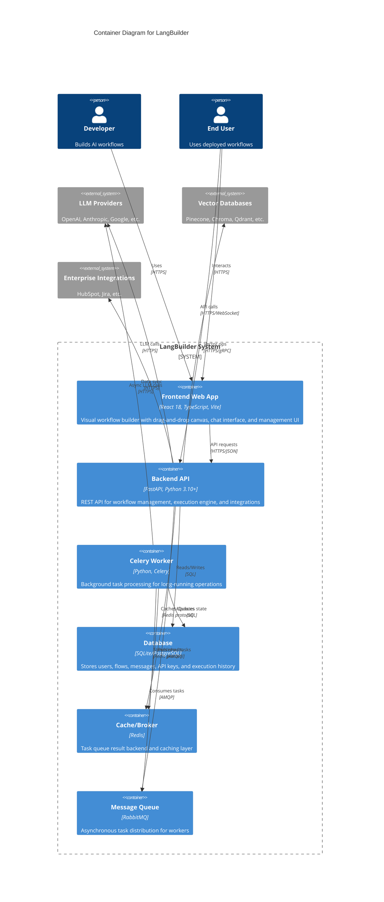

# C4 Container Diagram - LangBuilder

## Overview

This document presents the Container (Level 2) diagram for LangBuilder, showing the high-level technology choices and how containers communicate.

## Container Diagram



## Container Details

### Frontend Web App

| Attribute | Value |
|-----------|-------|
| **Technology** | React 18.3, TypeScript 5.4, Vite 5.4 |
| **Port** | 5175 (dev), 80 (production) |
| **Path** | `langbuilder/src/frontend/` |
| **State Management** | Zustand |
| **UI Framework** | Radix UI + TailwindCSS |
| **Flow Canvas** | @xyflow/react (XY Flow) |

**Key Responsibilities:**
- Visual workflow canvas for drag-and-drop design
- Real-time flow execution and testing
- Chat interface for deployed workflows
- User authentication and session management
- File upload and management

### Backend API

| Attribute | Value |
|-----------|-------|
| **Technology** | FastAPI, Python 3.10-3.14 |
| **Port** | 8002 (default), 7860 (Docker) |
| **Path** | `langbuilder/src/backend/base/langbuilder/` |
| **ORM** | SQLModel (SQLAlchemy + Pydantic) |
| **AI Framework** | LangChain 0.3.x |

**Key Responsibilities:**
- REST API for flow CRUD operations
- Workflow graph execution engine
- Component registry and discovery
- User authentication (JWT)
- WebSocket for real-time updates
- OpenAI-compatible API endpoint

**API Versions:**
- `/api/v1/*` - Primary API (18 routers)
- `/api/v2/*` - Extended API (2 routers)
- `/v1/chat/completions` - OpenAI compatibility layer

### Celery Worker

| Attribute | Value |
|-----------|-------|
| **Technology** | Celery with eventlet |
| **Concurrency** | 1 per worker (configurable) |
| **Broker** | RabbitMQ |
| **Backend** | Redis |

**Key Responsibilities:**
- Long-running workflow executions
- Batch operations (import/export)
- Scheduled tasks
- External API calls with retry logic

### Database

| Attribute | Value |
|-----------|-------|
| **Default** | SQLite (development) |
| **Production** | PostgreSQL 15+ |
| **Migrations** | Alembic |
| **ORM** | SQLModel |

**Key Tables:**
- `user` - User accounts and profiles
- `flow` - Workflow definitions (JSON graph)
- `folder` - Project organization
- `apikey` - API key management
- `message` - Chat message history
- `transaction` - Execution logs
- `vertex_build` - Node build results
- `variable` - Encrypted credentials
- `file` - Uploaded file metadata
- `publish_record` - External publication tracking

### Redis Cache

| Attribute | Value |
|-----------|-------|
| **Technology** | Redis 6.2+ |
| **Port** | 6379 |

**Key Responsibilities:**
- Celery task result backend
- Session caching
- Rate limiting data
- Temporary execution state

### RabbitMQ Message Queue

| Attribute | Value |
|-----------|-------|
| **Technology** | RabbitMQ 3.x |
| **Ports** | 5672 (AMQP), 15672 (Management) |

**Key Responsibilities:**
- Task distribution to workers
- Message persistence for reliability
- Work queue management

## Communication Patterns

### Synchronous Communication

```
Frontend <--HTTPS/JSON--> Backend API <--SQL--> Database
                              |
                              +--HTTPS--> LLM Providers
                              +--HTTPS--> Vector Stores
                              +--HTTPS--> Integrations
```

### Asynchronous Communication

```
Backend API --AMQP--> RabbitMQ --AMQP--> Celery Worker
                                              |
                                              +--SQL--> Database
                                              +--Redis--> Cache
                                              +--HTTPS--> External APIs
```

### Real-time Communication

```
Frontend <--WebSocket--> Backend API (SSE for build events)
```

## Deployment Configurations

### Development
- SQLite database
- Single backend process
- Vite dev server for frontend
- No message queue required

### Production (Docker)
- PostgreSQL database
- Multiple backend replicas
- Celery workers for async tasks
- RabbitMQ for task queue
- Redis for caching
- Traefik for load balancing

## Port Mapping

| Service | Development | Production |
|---------|-------------|------------|
| Frontend | 5175 | 80 |
| Backend | 8002 | 7860 |
| Database | 5432 (PG) | 5432 |
| Redis | 6379 | 6379 |
| RabbitMQ | 5672/15672 | 5672/15672 |
| Prometheus | 9090 | 9090 |
| Grafana | 3000 | 3000 |

---

*Generated by CloudGeometry AIx SDLC - Architecture Documentation*
