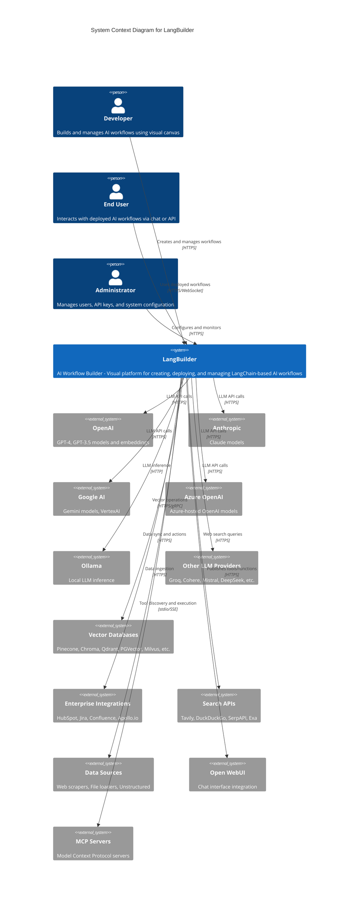

# C4 Context Diagram - LangBuilder

## Overview

This document presents the System Context (Level 1) diagram for LangBuilder, showing the system's boundaries and its interactions with users and external systems.

## System Context Diagram



## Context Description

### Users

| Actor | Description | Primary Interactions |
|-------|-------------|---------------------|
| **Developer** | Technical user who designs AI workflows using the visual canvas interface | Create flows, configure components, test and deploy workflows |
| **End User** | Consumer of deployed AI workflows | Interact via chat interface, API endpoints, or webhooks |
| **Administrator** | System administrator managing the platform | User management, API key configuration, monitoring |

### Core System

**LangBuilder** is an AI workflow builder that provides:

- Visual drag-and-drop canvas for workflow design
- Pre-built components for LLMs, vector stores, tools, and integrations
- Real-time workflow execution and testing
- API endpoints for deployed workflows
- Multi-tenant user management

### External Systems

#### LLM Providers (24 supported)

| Provider | Models | Use Case |
|----------|--------|----------|
| OpenAI | GPT-4, GPT-4o, GPT-3.5-turbo | General purpose, function calling |
| Anthropic | Claude 3.5, Claude 3 | Complex reasoning, long context |
| Google | Gemini Pro, Gemini Flash | Multimodal, fast inference |
| Azure OpenAI | Azure-hosted models | Enterprise compliance |
| Ollama | Llama, Mistral, Phi | Local/private deployment |
| Others | Groq, Cohere, Mistral, etc. | Specialized use cases |

#### Vector Databases (19 supported)

| Category | Examples | Purpose |
|----------|----------|---------|
| Cloud-hosted | Pinecone, Qdrant Cloud, Weaviate | Production RAG applications |
| Self-hosted | Chroma, Milvus, FAISS | Development and on-premise |
| Database extensions | PGVector, OpenSearch | Existing infrastructure leverage |

#### Enterprise Integrations (30+)

| Category | Examples | Capabilities |
|----------|----------|--------------|
| CRM | HubSpot, Apollo.io | Contact search, deal management |
| Collaboration | Jira, Confluence | Issue tracking, knowledge bases |
| Data | AWS DynamoDB, SES | Storage and communication |
| Search | Tavily, DuckDuckGo | Web search augmentation |

## Key Integration Patterns

1. **LLM Integration**: All LLM calls go through LangChain abstractions, enabling provider switching
2. **Vector Store Pattern**: Unified interface for retrieval operations across different vector databases
3. **Tool Invocation**: LangChain tools pattern for external API calls
4. **MCP Protocol**: Model Context Protocol for dynamic tool discovery and execution
5. **Webhook Support**: Inbound webhooks for external system triggers

## Security Boundaries

```
+------------------------------------------+
|           Internet Boundary              |
|  +------------------------------------+  |
|  |        Load Balancer (Traefik)     |  |
|  +------------------------------------+  |
|              |          |                |
|  +-----------|----------|-------------+  |
|  |       LangBuilder System           |  |
|  |  +--------+  +------------------+  |  |
|  |  |Frontend|  |  Backend API     |  |  |
|  |  +--------+  +------------------+  |  |
|  |                     |              |  |
|  |  +------------------+           |  |  |
|  |  |    Database      |           |  |  |
|  |  +------------------+           |  |  |
|  +------------------------------------+  |
+------------------------------------------+
                   |
        External API Calls (HTTPS)
                   |
    +--------------------------------+
    |    External Systems Boundary   |
    |  LLM APIs, Vector Stores, etc. |
    +--------------------------------+
```

## Data Flow Summary

1. **Inbound**: User requests via HTTPS to frontend or API endpoints
2. **Processing**: Backend processes requests, executes workflow graphs
3. **Outbound**: API calls to LLM providers, vector stores, and integrations
4. **Persistence**: Flow definitions and execution results stored in database

---

*Generated by CloudGeometry AIx SDLC - Architecture Documentation*
