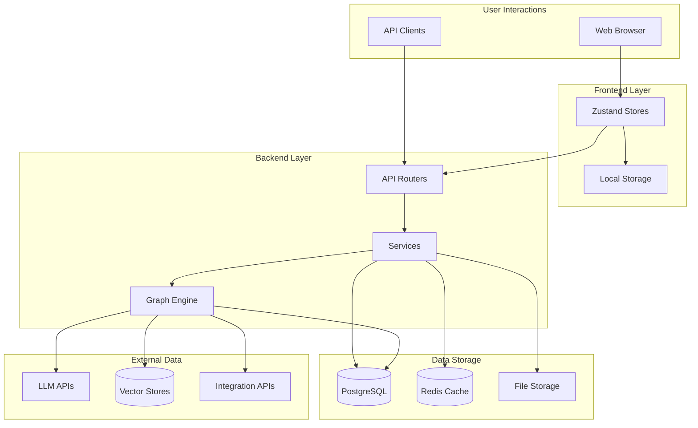
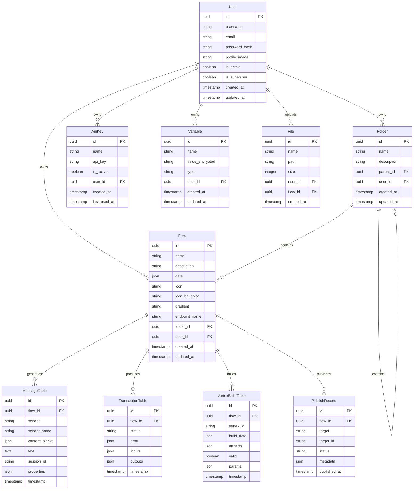

# Data Architecture - LangBuilder

## Overview

This document describes the data architecture for LangBuilder, including database schema, data flows, storage patterns, and caching strategies.

## Data Flow Diagram



## Database Schema

### Entity Relationship Diagram



## Core Data Models

### User Model

**Table**: `user`

| Column | Type | Description |
|--------|------|-------------|
| id | UUID | Primary key |
| username | VARCHAR(255) | Unique username |
| email | VARCHAR(255) | Unique email address |
| password | VARCHAR(255) | Bcrypt hashed password |
| profile_image | VARCHAR(512) | Profile image URL |
| is_active | BOOLEAN | Account active status |
| is_superuser | BOOLEAN | Admin privileges |
| created_at | TIMESTAMP | Creation timestamp |
| updated_at | TIMESTAMP | Last update timestamp |

### Flow Model

**Table**: `flow`

| Column | Type | Description |
|--------|------|-------------|
| id | UUID | Primary key |
| name | VARCHAR(255) | Flow name |
| description | TEXT | Flow description |
| data | JSONB | Flow graph data (nodes, edges) |
| icon | VARCHAR(50) | Display icon |
| icon_bg_color | VARCHAR(20) | Icon background color |
| gradient | VARCHAR(100) | UI gradient |
| endpoint_name | VARCHAR(255) | API endpoint name |
| folder_id | UUID | Parent folder (FK) |
| user_id | UUID | Owner user (FK) |
| created_at | TIMESTAMP | Creation timestamp |
| updated_at | TIMESTAMP | Last update timestamp |

**Flow Data Structure (JSONB)**:
```json
{
  "nodes": [
    {
      "id": "node-1",
      "type": "genericNode",
      "position": { "x": 100, "y": 200 },
      "data": {
        "type": "OpenAIModel",
        "node": {
          "template": { ... },
          "outputs": [ ... ],
          "display_name": "OpenAI"
        }
      }
    }
  ],
  "edges": [
    {
      "id": "edge-1",
      "source": "node-1",
      "target": "node-2",
      "sourceHandle": "output",
      "targetHandle": "input"
    }
  ],
  "viewport": { "x": 0, "y": 0, "zoom": 1 }
}
```

### Message Model

**Table**: `message`

| Column | Type | Description |
|--------|------|-------------|
| id | UUID | Primary key |
| flow_id | UUID | Associated flow (FK) |
| sender | VARCHAR(50) | Sender type (user/ai) |
| sender_name | VARCHAR(255) | Display name |
| content_blocks | JSONB | Rich content blocks |
| text | TEXT | Plain text content |
| session_id | VARCHAR(255) | Chat session identifier |
| properties | JSONB | Additional metadata |
| timestamp | TIMESTAMP | Message timestamp |

### Variable Model (Encrypted Credentials)

**Table**: `variable`

| Column | Type | Description |
|--------|------|-------------|
| id | UUID | Primary key |
| name | VARCHAR(255) | Variable name |
| value | TEXT | Encrypted value (Fernet) |
| type | VARCHAR(50) | Variable type (credential, secret) |
| user_id | UUID | Owner user (FK) |
| created_at | TIMESTAMP | Creation timestamp |
| updated_at | TIMESTAMP | Last update timestamp |

**Encryption**: Values encrypted using Fernet symmetric encryption with a per-installation key.

## Data Flow Patterns

### Flow Execution Data Flow

```
┌─────────┐    ┌─────────┐    ┌─────────┐    ┌─────────┐
│ Client  │───>│ Backend │───>│  Graph  │───>│   LLM   │
│ Request │    │   API   │    │ Engine  │    │   API   │
└─────────┘    └─────────┘    └─────────┘    └─────────┘
                    │              │              │
                    v              v              v
              ┌─────────┐    ┌─────────┐    ┌─────────┐
              │Load Flow│    │ Execute │    │  Store  │
              │from DB  │    │ Vertices│    │ Results │
              └─────────┘    └─────────┘    └─────────┘
                                  │
                    ┌─────────────┼─────────────┐
                    v             v             v
              ┌─────────┐  ┌─────────┐  ┌─────────┐
              │ Messages│  │  Vertex │  │  Trans- │
              │  Table  │  │  Builds │  │ actions │
              └─────────┘  └─────────┘  └─────────┘
```

### Chat Session Data Flow

```
1. User sends message
   └─> POST /api/v1/build/{flow_id}

2. Backend loads flow and creates session
   └─> Query: SELECT * FROM flow WHERE id = ?
   └─> Insert: INSERT INTO message (sender='user', ...)

3. Graph executes and streams response
   └─> SSE: Server-Sent Events for real-time updates
   └─> Insert: INSERT INTO vertex_build (...)

4. AI response stored
   └─> Insert: INSERT INTO message (sender='ai', ...)
   └─> Insert: INSERT INTO transaction (...)
```

## Caching Strategy

### Redis Cache Layers

```
┌─────────────────────────────────────────────────────────────┐
│                      Redis Cache                             │
├─────────────────────────────────────────────────────────────┤
│  Layer 1: Session Data                                       │
│  ├─ session:{session_id} -> User session data               │
│  ├─ token:{token} -> Token validation cache                 │
│  └─ TTL: 24 hours                                           │
├─────────────────────────────────────────────────────────────┤
│  Layer 2: Flow Execution State                               │
│  ├─ flow:{flow_id}:state -> Execution state                 │
│  ├─ flow:{flow_id}:build:{vertex_id} -> Build results       │
│  └─ TTL: 1 hour (or until flow completion)                  │
├─────────────────────────────────────────────────────────────┤
│  Layer 3: Component Registry                                 │
│  ├─ components:types -> Component type definitions          │
│  ├─ components:categories -> Category metadata              │
│  └─ TTL: Until application restart                          │
├─────────────────────────────────────────────────────────────┤
│  Layer 4: Rate Limiting                                      │
│  ├─ ratelimit:{user_id}:{endpoint} -> Request count         │
│  └─ TTL: Window duration (e.g., 1 minute)                   │
└─────────────────────────────────────────────────────────────┘
```

### Cache Invalidation

| Event | Invalidation Action |
|-------|-------------------|
| Flow update | Clear `flow:{id}:*` keys |
| User logout | Clear `session:{id}` |
| Component reload | Clear `components:*` |
| Deployment | Full cache flush |

## File Storage

### Storage Patterns

```
storage/
├── uploads/                    # User uploaded files
│   └── {user_id}/
│       └── {file_id}/
│           └── {filename}
├── flows/                      # Exported flow files
│   └── {flow_id}.json
└── temp/                       # Temporary processing
    └── {session_id}/
```

### File Metadata

Files are tracked in the database with actual content stored in filesystem or object storage (S3-compatible).

```python
# File model
class File(SQLModel, table=True):
    id: UUID
    name: str                    # Original filename
    path: str                    # Storage path
    size: int                    # File size in bytes
    content_type: str            # MIME type
    user_id: UUID                # Owner
    flow_id: Optional[UUID]      # Associated flow
    created_at: datetime
```

## Data Migration Strategy

### Alembic Migrations

**Path**: `langbuilder/src/backend/base/langbuilder/alembic/`

```
alembic/
├── env.py                      # Migration environment
├── script.py.mako              # Migration template
└── versions/                   # Migration scripts
    ├── 001_initial.py
    ├── 002_add_variables.py
    └── ...
```

**Migration Commands**:
```bash
# Create migration
alembic revision --autogenerate -m "description"

# Apply migrations
alembic upgrade head

# Rollback
alembic downgrade -1
```

## Data Security

### Encryption at Rest

| Data Type | Encryption Method |
|-----------|------------------|
| Passwords | Bcrypt hashing |
| Variables/Secrets | Fernet symmetric encryption |
| API Keys | Hashed storage |
| Database | PostgreSQL encryption (optional) |

### Access Control

```
┌─────────────────────────────────────────┐
│            Access Control               │
├─────────────────────────────────────────┤
│  User Scope:                            │
│  ├─ User can access own flows           │
│  ├─ User can access own folders         │
│  ├─ User can access own variables       │
│  └─ User can access own API keys        │
├─────────────────────────────────────────┤
│  Admin Scope:                           │
│  ├─ Admin can access all users          │
│  ├─ Admin can manage system settings    │
│  └─ Admin can view all flows            │
├─────────────────────────────────────────┤
│  API Key Scope:                         │
│  ├─ Read/Execute specific flow          │
│  └─ Limited to endpoint operations      │
└─────────────────────────────────────────┘
```

## Data Retention

### Retention Policies

| Data Type | Retention Period | Cleanup Strategy |
|-----------|-----------------|------------------|
| Messages | 90 days (configurable) | Scheduled job |
| Transactions | 30 days | Scheduled job |
| Vertex Builds | 7 days | Per-flow cleanup |
| Temp Files | 24 hours | Scheduled cleanup |
| Sessions | 24 hours | TTL expiration |

### Backup Strategy

```
Daily Backups:
├─ PostgreSQL: pg_dump full backup
├─ Redis: RDB snapshot
└─ Files: Incremental backup

Weekly:
├─ Full database backup
└─ Offsite replication

Retention:
├─ Daily: 7 days
├─ Weekly: 4 weeks
└─ Monthly: 12 months
```

## Query Patterns

### Common Queries

**List user flows**:
```sql
SELECT f.*, fo.name as folder_name
FROM flow f
LEFT JOIN folder fo ON f.folder_id = fo.id
WHERE f.user_id = :user_id
ORDER BY f.updated_at DESC
LIMIT :limit OFFSET :offset;
```

**Get flow with messages**:
```sql
SELECT f.*,
       json_agg(m.* ORDER BY m.timestamp) as messages
FROM flow f
LEFT JOIN message m ON m.flow_id = f.id
                    AND m.session_id = :session_id
WHERE f.id = :flow_id
GROUP BY f.id;
```

**Execution history**:
```sql
SELECT t.*, f.name as flow_name
FROM transaction t
JOIN flow f ON t.flow_id = f.id
WHERE f.user_id = :user_id
ORDER BY t.timestamp DESC
LIMIT 100;
```

### Index Strategy

```sql
-- User queries
CREATE INDEX idx_flow_user_id ON flow(user_id);
CREATE INDEX idx_folder_user_id ON folder(user_id);

-- Flow lookup
CREATE INDEX idx_flow_folder_id ON flow(folder_id);
CREATE INDEX idx_flow_endpoint_name ON flow(endpoint_name);

-- Message queries
CREATE INDEX idx_message_flow_session ON message(flow_id, session_id);
CREATE INDEX idx_message_timestamp ON message(timestamp);

-- Transaction queries
CREATE INDEX idx_transaction_flow_id ON transaction(flow_id);
CREATE INDEX idx_transaction_timestamp ON transaction(timestamp);
```

---

*Generated by CloudGeometry AIx SDLC - Architecture Documentation*
